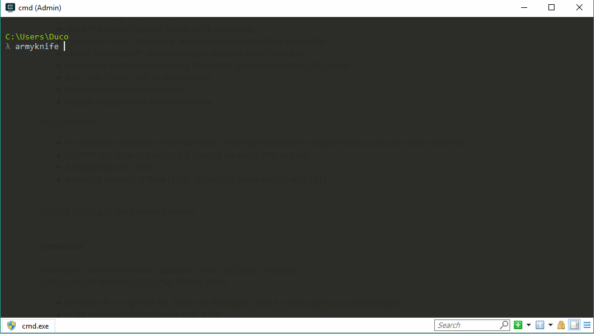

# Armyknife

| | |
| --- | --- |
| **Build** | [](https://ci.appveyor.com/project/dukeofharen/armyknife) [](https://travis-ci.org/dukeofharen/armyknife) |
| **Coverage** | [](https://coveralls.io/github/dukeofharen/armyknife?branch=refactoring%2Fcode-coverage) |
| **License** | [](https://opensource.org/licenses/MIT) |


[Download the latest version](https://github.com/dukeofharen/armyknife/releases/latest)

**Install on Windows**

Armyknife can be installed using <a href="https://chocolatey.org/">Chocolatey</a>, a package manager for Windows.

```
choco install armyknife -y
```

Armyknife is a nice little tool which contains many handy little command line tools. It contains tools like base64 encoder / decoder, URL shortener, SHA512 hasher and more.



For more information, see [dukeofharen.github.io/armyknife](https://dukeofharen.github.io/armyknife).

# Backlog
- Make tool cross platform, because it's written in .NET Core (only build for Windows for now).
- Add more tools.
- Add plugin system.

# Made possible by
This application was made using some wonderful frameworks, libraries, software and other resources, including (but not limited to):
- [.NET Core](https://www.microsoft.com/net/learn/get-started/windows)
- [Moq](https://github.com/moq/moq4)
- [HtmlAgilityPack](http://html-agility-pack.net/)
- [Newtonsoft.Json](https://www.newtonsoft.com/json)
- [OpenCover](https://github.com/OpenCover/opencover)
- [ReportGenerator](https://github.com/danielpalme/ReportGenerator)
- [ZXing.Net](https://github.com/micjahn/ZXing.Net)
- [Wikipedia list of filename extensions](https://en.wikipedia.org/wiki/List_of_filename_extensions)